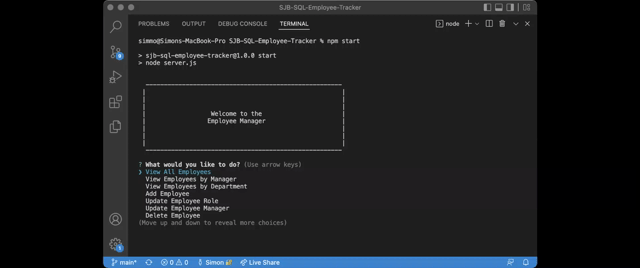

# Employee Tracker (SJB-SQL-Employee-Tracker)

##  Description

Employee Trackeis to build a command-line application to manage a company's employee database. This CMS appplication is built using Node.js, Inquirer, and MySQL.

## User Story

```md
AS A business owner
I WANT to be able to view and manage the departments, roles, and employees in my company
SO THAT I can organize and plan my business
```

## Preview 

###### Using Employee Tracker


###### Example of adding employee



###### Example of updating employee's roll and manager. Deleting employee


## Installation 

###### Local Installation
* Clone the repository from [Github](git@github.com:simmmmo/SJB-SQL-Employee-Tracker.git)
* Ensure Node.js is installed
* Ensure MySQL is installed
* Install dependencies 
[express package](https://www.npmjs.com/package/express)
```bash
npm install
```
```bash
npm i inquirer
```
```bash
npm i mysql2
```
```bash
npm i console.table
```
* Update SQL User and Password to local credentials
```bash
  {
    host: 'localhost',
    user: 'root',
    password: 'Pass123',
    database: 'employee_db'
  },
```
* Log into MySQL and import DB schema and seed files

```bash
mysql -u root -p

source db/schema.sql

source db/seed.sql
```

## Usage 

###### Local Environment 
Run 
```bash
npm start
```

Follow the menu prompts to VIEW/UPDATE/DELETE employee records

* Available Menu Options

```bash
View All Employees 
View Employees by Manager 
View Employees by Department 
Add Employee 
Update Employee Role 
Update Employee Manager 
Delete Employee 
View All Roles 
Add Role 
Delete Role 
View All Departments 
View Departments Salary Total
Add Department 
Delete Department  
Quit
```

###### Addition information
* Note - Before starting application, ensure MySQL credenitals have been updated
* Note - If a row is deleted that has child rows referencing the foreign key, the referencing cell's value will be updated to NULL. Effected Employee/role/department data will need to be reassigned.

## Technology 
* Node.js
* Express.js
* Inquirer
* MySQL
* console.table


## Project Links

###### Walkthrough video links
View All Employees, All Departments & All Roles

https://drive.google.com/file/d/1OwX7F96ahoQy8R5yG81LkEkUFum19XXr/view

Add Employees

https://drive.google.com/file/d/1B4wStgatIL27S-6WQuKJ6BRXGMhw8MPX/view

Update Employee's role and manager & delete Employee

https://drive.google.com/file/d/1cT7cWgVNBE25N2KJxMgLhxKK0DXXbdWg/view

Add department, add role to new department. Delete role

https://drive.google.com/file/d/1-fPsz5aP0Te7qzRwI5WJz3nl1C8Yjl5N/view

View Employees by manager and by department. View departments total salary spend

https://drive.google.com/file/d/1XwNynfmr3DyoiCgcbQ_bi-DrRmkToMzV/view


###### Repo name

* SJB-SQL-Employee-Tracker

###### GitHub enviroment

* https://github.com/simmmmo/SJB-SQL-Employee-Tracker
* git@github.com:simmmmo/SJB-SQL-Employee-Tracker.git

